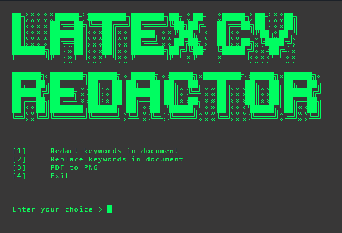
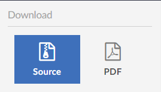
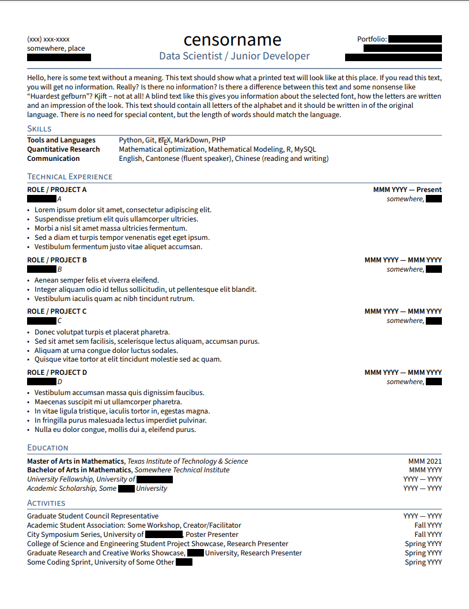

# LaTeX CV Redactor
Made this because I was fedup of manually changing my personal info for generic stuff every time I wanted a CV review from the nefarious strangers I talk to online ;)

NOTE: Limited testing on MACOS and Linux... Let me know if anything's not working. Cheers


## Table of Contents

- [LaTeX CV Redactor](#latex-cv-redactor)
  * [Prerequisites](#prerequisites)
  * [Setup](#setup)
    + [Example Usage](#example-usage)

## Prerequisites

You will need pdflatex installed on your machine
* [PdfLaTeX](https://www.latex-project.org/downloads/)

NOTE: Ensure that the main tex file is called `main.tex`


## Setup

Setup  and initialise virtual environment
```
# Setup virtual environment
virtualenv .venv

# Activate virtual environment OSX/Linux
source .venv/bin/activate

# Activate virtual environment Windows
.venv\Scripts\activate
```

Download/install requirements.txt
```
pip install -r requirements.txt
```

Go to your LaTeX project and download the .zip source file



Save the .zip file to this project's working directory

Before running the script, you need to create a file called "keywords.txt" in the same directory as the .zip file. This file should contain a list of keywords that you want the script to search for and replace in your CV. Write the keywords and replacement words in the following format:

```
FirstName : replacement1
LastName : replacement2
HomeTown : replacement3
# NOTE: spaces between the colon and the replacement word aren't necessary
```
NOTE: I still need to adapt the program to recognise a list of keywords rather than key/value pairs

Run main.py and provide the zip file name as the argument
```
python main.py <zip file name>
python main.py <folder name>
```

### Example Usage

Using the example zip file provided, depending on the settings you select in the menu, the script will search for the keywords in the CV and redact/replace them with the replacement words provided in the keywords.txt file.
```
python main.py CV.zip
```


Any issues, feel free to contact me on [Twitter](https://twitter.com/CuriousCoder4)
